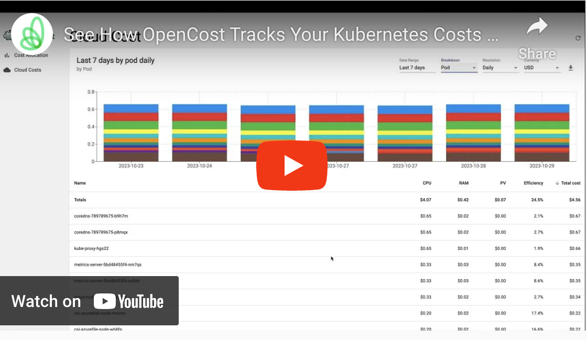

[](https://youtu.be/j_4aaE5zk7M)
*OpenCost UI Walkthrough*

# OpenCost — your favorite open source cost monitoring tool for Kubernetes

OpenCost models give teams visibility into current and historical Kubernetes spend and resource allocation. These models provide cost transparency in Kubernetes environments that support multiple applications, teams, departments, etc.

OpenCost was originally developed and open sourced by [Kubecost](https://kubecost.com). This project combines a [specification](/spec/) as well as a Golang implementation of these detailed requirements.


To see the full functionality of OpenCost you can view [OpenCost features](https://opencost.io). Here is a summary of features enabled:

- Real-time cost allocation by Kubernetes cluster, node, namespace, controller kind, controller, service, or pod
- Dynamic on-demand asset pricing enabled by integrations with AWS, Azure, and GCP billing APIs
- Supports on-prem k8s clusters with custom CSV pricing
- Allocation for in-cluster resources like CPU, GPU, memory, and persistent volumes.
- Easily export pricing data to Prometheus with /metrics endpoint ([learn more](https://www.opencost.io/docs/installation/prometheus))
- Free and open source distribution ([Apache2 license](LICENSE))

## Getting Started

You can deploy OpenCost on any Kubernetes 1.8+ cluster in a matter of minutes, if not seconds!

Visit the full documentation for [recommended install options](https://www.opencost.io/docs/installation/install).

## Usage

- [Cost APIs](https://www.opencost.io/docs/integrations/api)
- [CLI / kubectl cost](https://www.opencost.io/docs/integrations/kubectl-cost)
- [Prometheus Metrics](https://www.opencost.io/docs/integrations/prometheus)
- Reference [User Interface](https://github.com/opencost/opencost/tree/develop/ui)

## Using the UI

The OpenCost UI provides a visualization of the Kubernetes allocations and the related Cloud Costs.


After following the installation instructions, access the UI by port forwarding:
```
kubectl port-forward --namespace opencost service/opencost 9090
```
and connecting to [http://localhost:9090](http://localhost:9090)

## Contributing

We :heart: pull requests! See [`CONTRIBUTING.md`](CONTRIBUTING.md) for information on building the project from source
and contributing changes.

## Community

If you need any support or have any questions on contributing to the project, you can reach us on [CNCF Slack](https://slack.cncf.io/) in the [#opencost](https://cloud-native.slack.com/archives/C03D56FPD4G) channel or attend the biweekly [OpenCost Working Group community meeting](https://bit.ly/opencost-meeting) from the [Community Calendar](https://bit.ly/opencost-calendar) to discuss OpenCost development.

## FAQ

You can view [OpenCost documentation](https://www.opencost.io/docs/FAQ) for a list of commonly asked questions.
