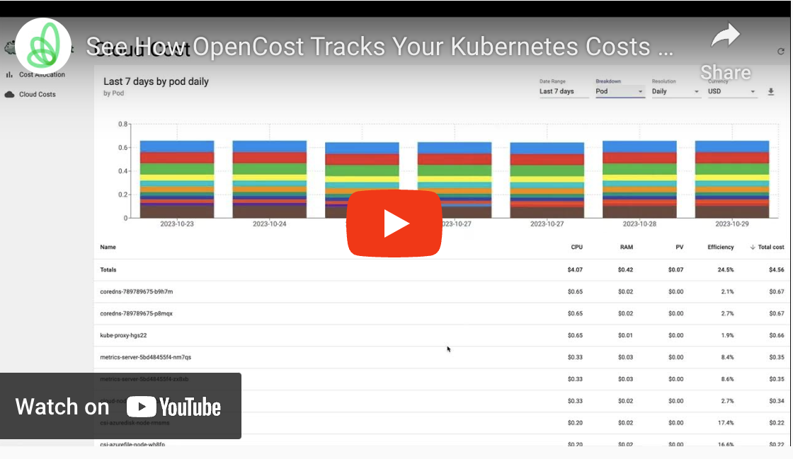

[](https://opensource.org/licenses/Apache-2.0)
[](https://www.bestpractices.dev/projects/6219)
[](https://gurubase.io/g/opencost)


# OpenCost — your favorite open source cost monitoring tool for Kubernetes and cloud spend

OpenCost give teams visibility into current and historical Kubernetes and cloud spend and resource allocation.
These models provide cost transparency in Kubernetes environments that support multiple applications, teams, departments, etc.
It also provides visibility into the cloud costs across multiple providers.

OpenCost was originally developed and open sourced by [Kubecost](https://kubecost.com). This project combines a [specification](/spec/) as well as a Golang implementation of these detailed requirements. The web UI is available in the [opencost/opencost-ui](http://github.com/opencost/opencost-ui) repository.

[](https://youtu.be/lCP4Ci9Kcdg)
*OpenCost UI Walkthrough*

To see the full functionality of OpenCost you can view [OpenCost features](https://opencost.io). Here is a summary of features enabled:

- Real-time cost allocation by Kubernetes cluster, node, namespace, controller kind, controller, service, or pod
- Multi-cloud cost monitoring for all cloud services on AWS, Azure, GCP
- Dynamic on-demand k8s asset pricing enabled by integrations with AWS, Azure, and GCP billing APIs
- Supports on-prem k8s clusters with custom CSV pricing
- Allocation for in-cluster K8s resources like CPU, GPU, memory, and persistent volumes
- Easily export pricing data to Prometheus with /metrics endpoint ([learn more](https://www.opencost.io/docs/installation/prometheus))
- Carbon costs for cloud resources
- Support for external costs like Datadog through [OpenCost Plugins](https://github.com/opencost/opencost-plugins)
- Free and open source distribution ([Apache2 license](LICENSE))

## Getting Started

You can deploy OpenCost on any Kubernetes 1.20+ cluster in a matter of minutes, if not seconds!

Visit the full documentation for [recommended installation options](https://www.opencost.io/docs/installation/install).

## Usage

- [Cost APIs](https://www.opencost.io/docs/integrations/api)
- [CLI / kubectl cost](https://www.opencost.io/docs/integrations/kubectl-cost)
- [Prometheus Metrics](https://www.opencost.io/docs/integrations/prometheus)
- [User Interface](https://www.opencost.io/docs/installation/ui)

## GCP Multi-Project Setup and Troubleshooting

If your GKE cluster, service account, and billing dataset are in different GCP projects, set the `GCP_CLOUD_COST_PROJECT_ID` environment variable to the project ID that should be used for cloud cost API calls. This ensures OpenCost can access billing and commitment data correctly.

Example (Helm values.yaml):

```yaml
opencost:
  exporter:
    env:
      - name: GCP_CLOUD_COST_PROJECT_ID
        value: "your-billing-project-id"
```

If not set, OpenCost will attempt to infer the project ID, but this may fail in multi-project setups.

### Troubleshooting
- Ensure your service account has access to the billing dataset and required APIs in the target project.
- Increase memory requests/limits for the OpenCost pod (e.g., 4GiB or more).
- For GCP Managed Prometheus, check for relabeling issues (namespace label may be renamed to `exported_namespace`).
- Check OpenCost logs for errors like `RESOURCE_PROJECT_INVALID` or "No Cloud Cost integrations currently configured."
- Try a longer time window (e.g., 1d or more) if you see zeroed-out values.

## Contributing

We :heart: pull requests! See [`CONTRIBUTING.md`](CONTRIBUTING.md) for information on building the project from source and contributing changes.

## Community

If you need any support or have any questions on contributing to the project, you can reach us on [CNCF Slack](https://slack.cncf.io/) in the [#opencost](https://cloud-native.slack.com/archives/C03D56FPD4G) channel or attend the biweekly [OpenCost Working Group community meeting](https://bit.ly/opencost-meeting) from the [Community Calendar](https://bit.ly/opencost-calendar) to discuss OpenCost development.

## FAQ

You can view [OpenCost documentation](https://www.opencost.io/docs/FAQ) for a list of commonly asked questions.
