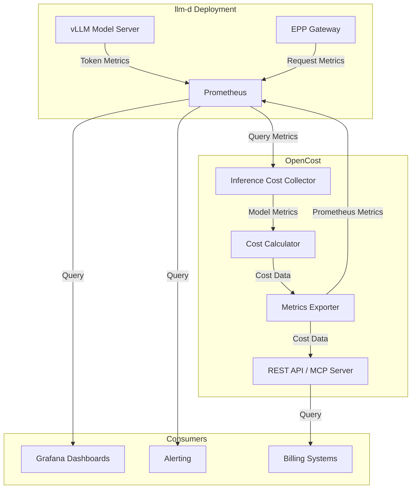

# AI Inference Cost Metrics for llm-d

## Summary

This proposal introduces cost tracking for AI inference deployed on llm-d. The solution enables tracking of self-hosting AI model costs, perform chargeback/showback across teams and workloads, and optimize resource allocation based on actual per-token costs calculated from infrastructure usage.

Cost tracking provides unified visibility across Kubernetes infrastructure, cloud resources, and self hosted AI inference workloads, enabling organizations to make data-driven decisions about model deployment configurations, compare self-hosting costs against commercial API alternatives, and measure the ROI of optimization techniques like KV cache and disaggregated serving.

## Motivation

As organizations scale their AI inference deployments on llm-d, understanding and optimizing infrastructure costs becomes critical. Platform teams need visibility into the actual cost of serving different models, workloads, and teams to make informed decisions about resource allocation, capacity planning, and optimization priorities.

Current challenges include:
- **Lack of cost visibility**: Teams don't know the actual infrastructure cost per token for their models
- **No chargeback mechanism**: Cannot attribute costs to specific teams or workloads for internal billing
- **Optimization blindness**: Cannot measure the cost impact of optimizations like KV cache hits or disaggregated serving
- **Self-hosting vs API comparison**: Cannot compare self-hosting costs against commercial API alternatives
- **Resource allocation**: Cannot make data-driven decisions about which models or configurations to prioritize
- **Multi-tenant cost allocation**: Cannot fairly distribute infrastructure costs across multiple teams and workloads sharing the same model servers

### Goals

1. **Infrastructure-based cost calculation**: Calculate per-token costs from actual GPU and memory infrastructure usage, not pre-configured pricing tables
2. **Multi-dimensional attribution**: Track costs by team, workload, model, model variant, and namespace
3. **Differentiated token pricing**: Provide separate costs for input (prompt) and output (generation) tokens based on actual compute time
4. **Seamless integration**: Integrate with existing llm-d metrics ecosystem (vLLM, EPP, GPU metrics) without duplication
5. **Disaggregation support**: Track costs for disaggregated serving (prefill/decode) deployments
6. **Production-ready**: Provide reliable, scalable cost tracking suitable for production deployments
7. **Optimization insights**: Enable measurement of cost savings from KV cache, prefix caching, and other optimizations

### Non-Goals

1. **Not replacing existing metrics**: This proposal does not replace llm-d's existing performance and operational metrics
2. **Not a billing system**: This is not a complete billing/invoicing system, but provides cost data for such systems
3. **Not training costs**: Focus is exclusively on inference costs, not model training or fine-tuning
4. **Not real-time billing**: Cost calculations are based on recent metrics (5-minute windows), not per-request billing
5. **Not cloud billing integration**: Does not directly integrate with cloud provider billing APIs (uses OpenCost's existing integrations)

### User Stories

#### Story 1: Platform Team Cost Optimization

As an inference platform team managing multiple llm-d deployments, I want to track infrastructure costs per model and variant so I can identify which configurations are most cost-effective and make data-driven decisions about resource allocation.

**Acceptance Criteria**:
- View cost per million tokens for each model
- Compare costs across different GPU types and configurations
- Identify models with highest infrastructure costs
- Track cost trends over time

#### Story 2: Finance Team Chargeback

As a finance team member, I want to attribute AI inference costs to specific application teams and workloads so that I have the necessary information to perform accurate chargeback and showback for internal billing purposes.  (Billing is out of scope) 

**Acceptance Criteria**:
- Query costs by namespace and team labels
- Generate cost reports for billing periods
- Export cost data for integration with billing systems
- Track costs by workload type (interactive vs batch)

#### Story 3: Platform Team Cost-Based Routing Optimization

As a platform team managing llm-d deployments, I want to use cost metrics to optimize routing decisions so I can direct requests to the most cost-effective model variants and configurations while maintaining SLO compliance.

**Acceptance Criteria**:
- Access real-time cost per token metrics for different model variants
- Route requests to lower-cost variants when SLOs permit
- Track cost savings from intelligent routing decisions
- Balance cost optimization with latency and throughput requirements
- Measure cost reduction from routing optimization over time

#### Story 4: Executive Team Strategic Decisions

As an executive team, I want to compare self-hosting costs against commercial API alternatives so I can make informed decisions about our AI infrastructure strategy.

**Acceptance Criteria**:
- View total cost per million tokens for self-hosted models
- Compare against commercial API pricing
- Understand cost breakdown (GPU, memory, network)
- Project costs at different scale levels

## Proposal

This proposal recommends adding infrastructure cost tracking for AI inference workloads on llm-d. After evaluating multiple approaches (detailed in the Alternatives section), we recommend **extending OpenCost** with a new inference cost domain that tracks AI inference costs alongside OpenCost's existing cost domains (Allocation, Asset, CloudCost, CustomCost).

### Why OpenCost?

OpenCost provides a good foundation for inference cost tracking because it:
- Already integrates with Kubernetes and Prometheus
- Has proven cost allocation algorithms for GPU infrastructure
- Provides unified visibility across infrastructure, cloud, and custom costs
- Offers REST API and MCP server for programmatic access
- Is open source and widely adopted in the Kubernetes ecosystem
- Collects general infrastructure costs - CPU, memory, network, overhead, etc.

### Alternative Approaches Considered

We evaluated several approaches before recommending OpenCost:

1. **Custom metrics in llm-d**: Would duplicate OpenCost's infrastructure cost tracking
2. **Commercial tools**: Conflicts with open source philosophy and adds licensing costs
3. **Manual tracking**: Not scalable for production deployments
4. **Pre-configured pricing**: Less accurate than infrastructure-based calculation

The OpenCost approach provides the best balance of accuracy, integration, and maintainability.

### High-Level Architecture

```
┌─────────────────────────────────────────────────────────────┐
│                         OpenCost                             │
│  ┌──────────────┐  ┌──────────────┐  ┌──────────────┐      │
│  │  Allocation  │  │  CloudCost   │  │  Inference   │ NEW  │
│  │    Costs     │  │    Costs     │  │    Costs     │      │
│  └──────────────┘  └──────────────┘  └──────────────┘      │
│                            │                                 │
│                   ┌────────▼────────┐                        │
│                   │   MCP Server    │                        │
│                   │   REST API      │                        │
│                   └─────────────────┘                        │
└─────────────────────────────────────────────────────────────┘
                             │
                 ┌───────────┴───────────┐
                 │                       │
         ┌───────▼────────┐     ┌───────▼────────┐
         │   Prometheus   │     │   llm-d vLLM   │
         │   (Metrics)    │     │   + EPP        │
         └────────────────┘     └────────────────┘
```

### Core Approach

In addition to collecting and calculating general infrastructure costs as is already done by OpenCost today, we will add inference specific csot metrics.

1. **Collect metrics from existing sources**:
   - Token metrics from vLLM (`vllm:prompt_tokens_total`, `vllm:generation_tokens_total`)
   - GPU costs from OpenCost's existing allocation system
   - Processing time metrics from vLLM for differentiated pricing
   - KV cache hits and usage metrics
   - Namespace and model labels for attribution

2. **Calculate infrastructure-based costs**:
   - Determine GPU cost per container based on allocation and node costs
   - Calculate total tokens processed in time window
   - Compute cost per token from infrastructure costs divided by token throughput
   - Allocate costs between input and output tokens based on actual processing time
   - Calculate cache hit savings
   - (Future) Calculate smart routing savings

3. **Export cost metrics**:
   - Prometheus metrics for monitoring and alerting
   - REST API for programmatic access
   - MCP server integration for AI agent queries
   - Grafana dashboards for visualization

4. **Enable multi-dimensional queries**:
   - Aggregate by model, namespace, team, workload, variant
   - Filter by time windows
   - Compare costs across different configurations

## Design Details

### Implementation Status

The proposal is based on a **working proof of concept** that has been developed and tested. The proof of concept demonstrates:

- Basic cost metrics (total cost, cost per million tokens)
- Differentiated input/output costs with compute-time allocation

The POC validates the technical approach and provides a foundation for production implementation.

### Key Components

#### 1. New Package: `opencost/pkg/inferencecost/`

A new package in OpenCost containing:

- **`types.go`**: Data structures for model metrics and configuration
- **`collector.go`**: Prometheus metric collection from vLLM and GPU sources
- **`calculator.go`**: Cost calculation logic with compute-time allocation
- **`exporter.go`**: Prometheus metrics export

#### 2. Exported Metrics

**Cost Metrics**:
- `opencost_inference_total_cost`: Hourly GPU infrastructure cost per model
- `opencost_inference_cost_per_million_tokens`: Blended cost per 1M tokens
- `opencost_inference_input_cost_per_million_tokens`: Cost per 1M input tokens
- `opencost_inference_output_cost_per_million_tokens`: Cost per 1M output tokens
- Additional metrics to be added in the future

**Labels**: `model_name`, `model_version`, `namespace`, `allocation_method`

#### 3. POC Cost Calculation Methodology

**Infrastructure Cost Calculation**:
```
GPU Cost = GPU Allocation × Node GPU Hourly Cost × Utilization
Total Infrastructure Cost = GPU Cost + CPU Cost + Memory Cost + Network Cost + Overhead
```

**Compute-Time Based Input/Output Token Allocation** (Primary Method):
```
Input Processing Time = rate(vllm:request_prefill_time_seconds[5m]) × 300
Output Processing Time = rate(vllm:time_per_output_token_seconds[5m]) × 300
Total Processing Time = Input Processing Time + Output Processing Time

Input Cost = Total Infrastructure Cost × (Input Processing Time / Total Processing Time)
Output Cost = Total Infrastructure Cost × (Output Processing Time / Total Processing Time)

Input Cost Per Token = Input Cost / Total Input Tokens
Output Cost Per Token = Output Cost / Total Output Tokens
```

**Multiplier-Based Allocation** (Fallback):
```
Weighted Tokens = Input Tokens + (Output Tokens × Multiplier)
Input Cost Per Token = Total Infrastructure Cost / Weighted Tokens
Output Cost Per Token = Input Cost Per Token × Multiplier
```

Default multiplier: 2.5× (configurable)

#### 4. Configuration

**Environment Variables**:
- `INFERENCE_COST_ENABLED`: Enable/disable feature (default: false)
- `INFERENCE_COST_COLLECTION_INTERVAL`: Collection interval in seconds (default: 60)
- `INFERENCE_COST_ALLOCATION_MODE`: `compute_time` or `multiplier` (default: compute_time)
- `INFERENCE_OUTPUT_TOKEN_COST_MULTIPLIER`: Multiplier for output tokens (default: 2.5)
- `PROMETHEUS_SERVER_ENDPOINT`: Prometheus server URL

**Kubernetes Deployment Example**:
```yaml
apiVersion: apps/v1
kind: Deployment
metadata:
  name: opencost
spec:
  template:
    spec:
      containers:
      - name: opencost
        image: opencost/opencost:latest
        env:
        - name: INFERENCE_COST_ENABLED
          value: "true"
        - name: INFERENCE_COST_ALLOCATION_MODE
          value: "compute_time"
        - name: PROMETHEUS_SERVER_ENDPOINT
          value: "http://prometheus-server:9090"
```

#### 5. Integration with llm-d

**Required vLLM Metrics** (already exported by llm-d):
- `vllm:prompt_tokens_total` - Input tokens processed
- `vllm:generation_tokens_total` - Output tokens generated
- `vllm:request_prefill_time_seconds` - Time processing input
- `vllm:time_per_output_token_seconds` - Time generating output

**Required Labels** (already present):
- `model_name` - Model identifier
- `namespace` - Kubernetes namespace

**No Changes Required** in llm-d deployments - metrics are already available.

#### 6. Usage Examples

**Query cost per million tokens**:
```promql
opencost_inference_cost_per_million_tokens{model_name="Qwen/Qwen3-32B"}
```

**Compare input vs output costs**:
```promql
opencost_inference_input_cost_per_million_tokens{model_name="Qwen/Qwen3-32B"}
opencost_inference_output_cost_per_million_tokens{model_name="Qwen/Qwen3-32B"}
```

**Calculate total cost over time**:
```promql
sum(rate(opencost_inference_total_cost[5m])) * 300
```

**Cost by namespace**:
```promql
sum by (namespace) (opencost_inference_total_cost)
```

### Architecture Diagram



### Roadmap

**Proof of Concept (Phases 1 and 2)**:
- ✅ Phase 1: Basic cost metrics (total cost, cost per million tokens)
- ✅ Phase 1: Multi-namespace support
- ✅ Phase 1: Prometheus metrics export
- ✅ Phase 2: Differentiated input/output token costs
- ✅ Phase 2: Compute-time based allocation


**Proposed Implementation Phases**:
- **Phase 3**: Add CPU, RAM, Networking and overhead costs to inference costs
- **Phase 4**: Integration with OpenCost UI and APIs
- **Phase 5**: KV cache cost tracking and savings calculation
- **Phase 6**: Workload and team-based attribution
- **Phase 7**: Disaggregated serving cost breakdown (prefill/decode)
- **Phase 8**: Historical cost data storage and trending

## Alternatives

### Alternative 1: Custom Metrics in llm-d

**Approach**: Add cost calculation directly to llm-d components (EPP, vLLM sidecars).

**Pros**:
- Tighter integration with llm-d
- No dependency on OpenCost

**Cons**:
- Duplicates OpenCost's proven cost allocation logic
- Requires reimplementing infrastructure cost tracking
- No unified view with Kubernetes and cloud costs
- More maintenance burden on llm-d team

**Decision**: Rejected - OpenCost provides better infrastructure for cost tracking.

### Alternative 2: Commercial Cost Management Tools

**Approach**: Use commercial tools like Kubecost, CloudHealth, or Datadog.

**Pros**:
- Feature-rich with UI and reporting
- Professional support

**Cons**:
- Not open source
- Vendor lock-in
- Additional licensing costs
- May not support AI-specific metrics

**Decision**: Rejected - Conflicts with llm-d's open source philosophy.

### Alternative 3: Manual Cost Tracking

**Approach**: Calculate costs manually using spreadsheets and periodic metric exports.

**Pros**:
- No additional infrastructure
- Full control over calculations

**Cons**:
- Not scalable
- Error-prone
- No real-time visibility
- High operational overhead

**Decision**: Rejected - Not suitable for production deployments.

### Alternative 4: Pre-configured Pricing Tables

**Approach**: Use fixed per-token pricing based on model size and GPU type.

**Pros**:
- Simpler implementation
- Predictable costs

**Cons**:
- Doesn't reflect actual infrastructure usage
- Requires manual price updates
- Doesn't account for optimizations (cache hits, utilization)
- Less accurate for cost attribution

**Decision**: Rejected - Infrastructure-based calculation is more accurate.

## Proof of Concept References

The proof of concept is documented in this repository:

- **[`AI_INFERENCE_COST_TRACKING_PLAN.md`](AI_INFERENCE_COST_TRACKING_PLAN.md)**: Complete technical plan and analysis
- **[`PHASE1_DETAILED_DESIGN.md`](PHASE1_DETAILED_DESIGN.md)**: Detailed Phase 1 design specifications
- **[`IMPLEMENTATION_SUMMARY.md`](IMPLEMENTATION_SUMMARY.md)**: Phase 1 implementation summary
- **[`INFERENCE_COST_DIFFERENTIATION_IMPLEMENTATION.md`](INFERENCE_COST_DIFFERENTIATION_IMPLEMENTATION.md)**: Phase 2 implementation details
- **[`opencost/docs/inference-cost-tracking.md`](opencost/docs/inference-cost-tracking.md)**: User documentation
- **[`opencost/pkg/inferencecost/`](opencost/pkg/inferencecost/)**: Implementation code

## Success Criteria

This proposal will be considered successful when:

1. **Adoption**: llm-d documentation recommends OpenCost for cost tracking
2. **Integration**: llm-d guides include OpenCost deployment instructions
3. **Validation**: Cost metrics validated against cloud billing for accuracy
4. **Usage**: Multiple organizations using cost metrics in production
5. **Feedback**: Positive feedback from platform teams on cost visibility
6. **Optimization**: Documented case studies of cost optimization using metrics

## Next Steps

1. **Community Review**: Present proposal to llm-d community for feedback
2. **Documentation**: Add OpenCost integration guide to llm-d documentation
3. **Examples**: Create example deployments and Grafana dashboards
4. **Testing**: Validate across different llm-d deployment patterns
5. **Upstream**: Contribute OpenCost changes to upstream OpenCost project
6. **Roadmap**: Plan Phase 3+ enhancements based on community feedback