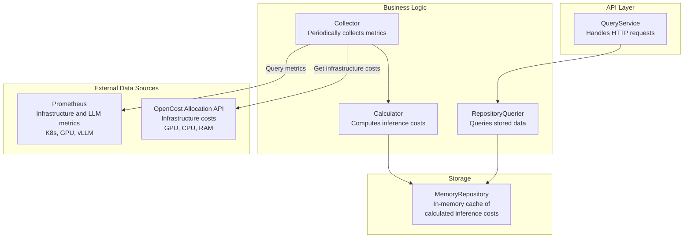

# OpenCost Inference Cost API Design

**Authors:** Sima Nadler (IBM)  
**Status:** Design Proposal  
**Based on:** [Inference Cost Proposal](https://github.com/llm-d/llm-d/pull/1646)

## Executive Summary

This document defines the REST APIs for OpenCost's new Inference Cost domain. Following the established patterns from OpenCost's [CloudCost](https://opencost.io/docs/integrations/api#cloudcost) and [CustomCost](https://opencost.io/docs/integrations/api#customcosttimeseries) APIs, this design introduces endpoints for querying AI inference costs with support for both **usage-based** and **allocation-based** cost metrics.

### Core Metrics (Phase 1)

We will focus initially on four primary metrics from the [proposal](https://github.com/llm-d/llm-d/pull/1646):

1. **`llm_total_cost`** - Hourly cost per model
2. **`llm_cost_per_million_tokens`** - Blended cost per 1M tokens
3. **`llm_input_cost_per_million_tokens`** - Cost per 1M input tokens
4. **`llm_output_cost_per_million_tokens`** - Cost per 1M output tokens

Each metric is available in both **usage-based** and **allocation-based** variants.
Additional metrics mentioned in the proposal will be added later.

---

## Design Principles

### 1. Consistency with Existing OpenCost APIs

Follow the established patterns from:
- [`/cloudCost`](../../pkg/cloudcost/queryservice.go) - Query structure, filtering, aggregation
- [`/customCost`](../../pkg/customcost/queryservice.go) - Time series and totals patterns
- [`/allocation`](../../pkg/costmodel/aggregation.go) - Window handling, accumulation

### 2. Cost Basis Duality

Support both cost perspectives as defined in the [proposal](https://github.com/llm-d/llm-d/pull/1646):

**Usage-Based Cost:**
- Measures intrinsic inference cost (GPU and other infrastructure costs during active processing)
- Stable regardless of utilization
- Best for comparing model efficiency and external API pricing
- Excludes idle time costs

**Allocation-Based Cost:**
- Measures full business cost (includes idle time, model availability)
- Varies with utilization
- Reconciles to infrastructure bills
- Best for chargeback and total cost of ownership

### 3. Multi-Dimensional Attribution

Support aggregation and filtering by:
- `model_name` - e.g., "meta-llama/Llama-3.1-8B-Instruct"
- `model_version` - e.g., "v1.0"
- `model_variant` - e.g., "LoRa A", "fp16"
- `namespace` - Kubernetes namespace
- `product` - Product/team label
- `allocation` - Cost allocation label
- `workload` - e.g. "inference"
- `label` - e.g. "testing"

---

## Data Structures

### InferenceCost

Core data structure representing inference costs for a model in a specific time window.

```go
package inferencecost

import (
    "time"
    "github.com/opencost/opencost/core/pkg/opencost"
)

// InferenceCost represents inference cost data for specific model
type InferenceCost struct {
    // Properties identify the model and context
    Properties InferenceCostProperties `json:"properties"`
    
    // Window defines the time range for this cost data
    Window opencost.Window `json:"window"`
    
    // Cost basis - determines which cost metrics are populated - usage or allocation
    CostBasis CostBasis `json:"costBasis"`
    
    // Total cost for the window
    TotalCost float64 `json:"totalCost"`
    
    // Token Metrics
    PromptTokens     float64 `json:"promptTokens"`
    GenerationTokens float64 `json:"generationTokens"`
    TotalTokens      float64 `json:"totalTokens"`
    
    // Blended Cost Metrics 
    CostPerToken         float64 `json:"costPerToken"`
    CostPerMillionTokens float64 `json:"costPerMillionTokens"`
    
    // Differentiated Cost Metrics
    InputCost                  float64 `json:"inputCost"`
    OutputCost                 float64 `json:"outputCost"`
    InputCostPerToken          float64 `json:"inputCostPerToken"`
    OutputCostPerToken         float64 `json:"outputCostPerToken"`
    InputCostPerMillionTokens  float64 `json:"inputCostPerMillionTokens"`
    OutputCostPerMillionTokens float64 `json:"outputCostPerMillionTokens"`
    
    // Metadata
    Start time.Time `json:"start"`
    End   time.Time `json:"end"`
}

// InferenceCostProperties identifies a unique inference cost entity
type InferenceCostProperties struct {
    ModelName    string `json:"modelName"`
    ModelVersion string `json:"modelVersion,omitempty"`
    ModelVariant string `json:"modelVariant,omitempty"` 
    Namespace    string `json:"namespace"`
    Product      string `json:"product,omitempty"`
    Allocation   string `json:"allocation,omitempty"`
    Workload     string `json:"workload,omitempty"`
    Cluster      string `json:"cluster,omitempty"`
    Label        string `json:"label,omitempty"`
}

// CostBasis defines whether costs are usage-based or allocation-based
type CostBasis string

const (
    CostBasisUsage       CostBasis = "usage"       // Active compute only
    CostBasisAllocation  CostBasis = "allocation" // Full hosting cost
)

// InferenceCostSet represents a collection of InferenceCosts for a time window
type InferenceCostSet struct {
    InferenceCosts map[string]*InferenceCost `json:"inferenceCosts"`
    Window         opencost.Window           `json:"window"`
}

// InferenceCostSetRange represents multiple InferenceCostSets over time
type InferenceCostSetRange struct {
    InferenceCostSets []*InferenceCostSet `json:"inferenceCostSets"`
    Window            opencost.Window     `json:"window"`
}
```

### Query Request/Response

```go
// QueryRequest defines parameters for querying inference costs
type QueryRequest struct {
    // Time window
    Start time.Time `json:"start"`
    End   time.Time `json:"end"`
    
    // Cost basis selection
    CostBasis CostBasis `json:"costBasis"` // "usage" or "allocation"
    
    // Aggregation
    Aggregate []string `json:"aggregate,omitempty"` // e.g., ["model_name", "namespace"]
    
    // Filtering
    Filter string `json:"filter,omitempty"` // Filter expression
    
    // Accumulation
    Accumulate string `json:"accumulate,omitempty"` // "hour", "day", "week", "month"
}

// QueryResponse wraps the InferenceCostSetRange with metadata
type QueryResponse struct {
    Code    int                    `json:"code"`
    Status  string                 `json:"status"`
    Data    *InferenceCostSetRange `json:"data"`
    Message string                 `json:"message,omitempty"`
}
```

---

## API Endpoints

Following the **CustomCost API pattern** and **Approach 1 (Single API with Cost Basis Parameter)**, we provide two specialized endpoints that support both usage-based and allocation-based cost queries through the `costBasis` parameter.

See appendix for other approaches considered.

### Query Parameters

All inference cost endpoints support the following query parameters:

| Parameter | Type | Required | Default | Description |
|-----------|------|----------|---------|-------------|
| `window` | string | Yes | - | Time range in format `start,end` (RFC3339 timestamps) |
| `costBasis` | string | No | `allocation` | Cost calculation basis: `usage` (active compute only) or `allocation` (full hosting cost including idle time) |
| `aggregate` | string | No | - | Comma-separated list of properties to aggregate by (e.g., `model_name,namespace`) |
| `filter` | string | No | - | Filter expression using property:value syntax (see Filter Syntax section) |
| `accumulate` | string | No* | - | Time accumulation period: `hour`, `day`, `week`, `month` (*required for `/timeseries` endpoint) |

**Cost Basis Parameter:**
- `usage` - Returns intrinsic inference costs (GPU and other infrastructure use during active processing). Stable regardless of utilization. Best for comparing model efficiency and external API pricing.
- `allocation` - Returns full business costs (includes idle time and model availability). Varies with utilization. Best for chargeback and total cost of ownership. **This is the default.**

---

### 1. Query Inference Cost Totals

**Endpoint:** `GET /inferenceCost/total`

**Description:** Get aggregated totals for inference costs over a time window. Supports both usage-based and allocation-based cost queries via the `costBasis` parameter.

**Example Request:**

```bash
GET /inferenceCost/total?window=2024-01-01T00:00:00Z,2024-01-08T00:00:00Z&costBasis=allocation&aggregate=model_name
```

**Example Response:**

```json
{
  "code": 200,
  "status": "success",
  "data": {
    "window": {
      "start": "2024-01-01T00:00:00Z",
      "end": "2024-01-08T00:00:00Z"
    },
    "totals": {
      "llama-3.1-8b": {
        "properties": {
          "modelName": "meta-llama/Llama-3.1-8B-Instruct"
        },
        "costBasis": "allocation",
        "totalCost": 558.60,
        "promptTokens": 98000000,
        "generationTokens": 42000000,
        "totalTokens": 140000000,
        "costPerMillionTokens": 3.99,
        "inputCost": 205.80,
        "outputCost": 352.80,
        "inputCostPerMillionTokens": 2.10,
        "outputCostPerMillionTokens": 8.40
      },
      "mistral-7b": {
        "properties": {
          "modelName": "mistralai/Mistral-7B-Instruct-v0.2"
        },
        "costBasis": "allocation",
        "totalCost": 410.40,
        "promptTokens": 126000000,
        "generationTokens": 54000000,
        "totalTokens": 180000000,
        "costPerMillionTokens": 2.28,
        "inputCost": 151.20,
        "outputCost": 259.20,
        "inputCostPerMillionTokens": 1.20,
        "outputCostPerMillionTokens": 4.80
      }
    }
  }
}
```

---

### 2. Query Inference Cost Time Series

**Endpoint:** `GET /inferenceCost/timeseries`

**Description:** Get time-series data for inference costs with specified accumulation period. Supports both usage-based and allocation-based cost queries via the `costBasis` parameter. The `accumulate` parameter is required for this endpoint.

**Example Request:**

```bash
GET /inferenceCost/timeseries?window=2024-01-01T00:00:00Z,2024-01-08T00:00:00Z&costBasis=usage&aggregate=model_name&accumulate=day
```

**Example Response:**

```json
{
  "code": 200,
  "status": "success",
  "data": {
    "window": {
      "start": "2024-01-01T00:00:00Z",
      "end": "2024-01-08T00:00:00Z"
    },
    "series": [
      {
        "window": {
          "start": "2024-01-01T00:00:00Z",
          "end": "2024-01-02T00:00:00Z"
        },
        "inferenceCosts": {
          "llama-3.1-8b": {
            "properties": {
              "modelName": "meta-llama/Llama-3.1-8B-Instruct"
            },
            "costBasis": "usage",
            "totalCost": 24.50,
            "promptTokens": 14000000,
            "generationTokens": 6000000,
            "totalTokens": 20000000,
            "costPerMillionTokens": 1.225,
            "inputCost": 9.80,
            "outputCost": 14.70,
            "inputCostPerMillionTokens": 0.700,
            "outputCostPerMillionTokens": 2.450
          }
        }
      },
      {
        "window": {
          "start": "2024-01-02T00:00:00Z",
          "end": "2024-01-03T00:00:00Z"
        },
        "inferenceCosts": {
          "llama-3.1-8b": {
            "properties": {
              "modelName": "meta-llama/Llama-3.1-8B-Instruct"
            },
            "costBasis": "usage",
            "totalCost": 26.25,
            "promptTokens": 15000000,
            "generationTokens": 6000000,
            "totalTokens": 21000000,
            "costPerMillionTokens": 1.25,
            "inputCost": 10.50,
            "outputCost": 15.75,
            "inputCostPerMillionTokens": 0.700,
            "outputCostPerMillionTokens": 2.625
          }
        }
      }
    ]
  }
}
```

---

## Cost Basis Handling Design

The Inference Cost API implements a **single, unified API with a cost basis parameter** approach. This design allows clients to query either usage-based or allocation-based costs through the same endpoints using the `costBasis` query parameter.

### Implementation: Single API with Cost Basis Parameter

**Pros:**
- Single, unified API surface
- Consistent with OpenCost's philosophy of flexible querying
- Easy to compare both cost bases in client applications
- Follows OpenCost's pattern of using query parameters (e.g., shareIdle, includeIdle) to vary cost perspective without forking endpoints — but costBasis introduces a genuinely new perspective (active-processing time vs. full runtime) that no existing parameter expresses.

**Cons:**
- Backend must maintain both cost calculations
- Slightly more complex query parsing

**Implementation:**

```go
// Single endpoint with costBasis parameter
GET /inferenceCost?window=...&costBasis=usage
GET /inferenceCost?window=...&costBasis=allocation
```

**Backend Structure:**

```go
type InferenceCostCollector struct {
    // Collects both usage and allocation metrics
    usageMetrics       map[string]*InferenceCost
    allocationMetrics  map[string]*InferenceCost
}

func (c *InferenceCostCollector) Query(req QueryRequest) (*InferenceCostSetRange, error) {
    switch req.CostBasis {
    case CostBasisUsage:
        return c.queryUsageCosts(req)
    case CostBasisAllocation:
        return c.queryAllocationCosts(req)
    default:
        return c.queryAllocationCosts(req) // Default to allocation
    }
}
```

### Design Rationale

This approach was chosen for the following reasons:

1. **Consistency with OpenCost Patterns:** Matches OpenCost's existing pattern of using parameters for different cost perspectives (e.g., `shareIdle`, `includeIdle`, `sharedNamespaces` in the allocation API). This creates a familiar experience for users already working with OpenCost.

2. **Flexibility:** Clients can easily switch between cost bases without changing endpoints or API integration code. The same query structure works for both usage and allocation costs.

3. **Extensibility:** Easy to add new cost bases in the future (e.g., `amortized`, `spot`) without breaking existing API contracts or requiring new endpoints.

4. **Simplicity:** Single API surface reduces maintenance burden and documentation complexity. Developers only need to learn one set of endpoints.

5. **Comparison Capability:** Clients can make parallel requests to compare both cost bases:
   ```javascript
   const [usage, allocation] = await Promise.all([
       fetch('/inferenceCost/total?window=...&costBasis=usage'),
       fetch('/inferenceCost/total?window=...&costBasis=allocation')
   ]);
   ```

6. **Sensible Default:** Defaults to `allocation` (full cost) which is most useful for chargeback scenarios and aligns with infrastructure billing reconciliation.

7. **Why not reuse shareIdle?** 
   - Workload cost basis is max(request, usage) × runtime × price regardless of share flags.
   - costBasis=usage charges only active token-generation time — a new axis no existing flag covers.

**Example Usage:**

```bash
# Query usage-based costs (intrinsic efficiency)
GET /inferenceCost/total?window=2024-01-01T00:00:00Z,2024-01-08T00:00:00Z&costBasis=usage&aggregate=model_name

# Query allocation-based costs (full business cost) - default behavior
GET /inferenceCost/total?window=2024-01-01T00:00:00Z,2024-01-08T00:00:00Z&aggregate=model_name
```

---

## Filter Syntax

Following OpenCost's filter pattern from CloudCost and Allocation APIs:

```
filter := <expression> [ "+" <expression> ]*
expression := <property> ":" <value>
property := "model_name" | "model_version" | "model_variant" | "namespace" | "product" | "allocation" | "workload" | "cluster"
value := <string> | <quoted-string>
```

**Examples:**

```bash
# Single filter
filter=namespace:"llm-prod"

# Multiple filters (AND)
filter=namespace:"llm-prod"+model_name:"llama"

# Wildcard support
filter=model_name:"*llama*"

# Multiple values (OR within property)
filter=namespace:"llm-prod","llm-staging"
```

---

## Aggregation Properties

Supported aggregation dimensions:

| Property | Description | Example |
|----------|-------------|---------|
| `model_name` | Full model identifier | `meta-llama/Llama-3.1-8B-Instruct` |
| `model_version` | Model version | `v1.0` |
| `model_variant` | Deployment variant | `LoRa A`, `fp16` |
| `namespace` | Kubernetes namespace | `llm-prod` |
| `product` | Product label | `customer-support-agent` |
| `allocation` | Cost allocation label | `team-ml-platform` |
| `workload` | Workload type | `inference` |
| `cluster` | Cluster identifier | `prod-cluster-1` |

**Example:**

```bash
# Aggregate by model and namespace
aggregate=model_name,namespace

# Aggregate by product for chargeback
aggregate=product

# Aggregate by model variant for disaggregated serving analysis
aggregate=model_name,model_variant
```

---

## Integration with OpenCost Components

### Router Registration

Following the pattern from [`router.go`](../pkg/costmodel/router.go):

```go
// In pkg/costmodel/router.go
func InitializeInferenceCost(router *httprouter.Router) *inferencecost.QueryService {
    log.Debugf("Inference Cost config path: %s", env.GetInferenceCostConfigPath())
    
    // Initialize collector
    collector, err := inferencecost.NewCollector(inferencecost.DefaultConfig())
    if err != nil {
        log.Errorf("Failed to initialize inference cost collector: %v", err)
        return nil
    }
    
    // Initialize repository and wire collector to it
    repo := inferencecost.NewMemoryRepository()
    collector.SetRepository(repo)
    
    // Initialize querier
    querier := inferencecost.NewRepositoryQuerier(repo)
    
    // Initialize query service
    queryService := inferencecost.NewQueryService(querier)
    
    // Register endpoints - both support costBasis parameter
    router.GET("/inferenceCost/total", queryService.GetInferenceCostTotalHandler())
    router.GET("/inferenceCost/timeseries", queryService.GetInferenceCostTimeseriesHandler())
    
    return queryService
}
```

### Service Architecture



**Architecture Explanation:**

1. **Prometheus**: Stores all infrastructure and LLM metrics from multiple sources (Kubernetes, GPUs, vLLM). The Collector queries Prometheus for token metrics like `vllm_prompt_tokens_total` and `vllm_generation_tokens_total`.

2. **OpenCost Allocation API**: Provides infrastructure cost data (GPU, CPU, RAM costs per pod/namespace). The Collector uses this to determine the cost basis for inference calculations.

3. **MemoryRepository**: An in-memory cache that stores the calculated `InferenceCost` objects. This allows fast query responses without recalculating costs on every API request.

4. **Collector**: Runs periodically to:
   - Query token metrics from Prometheus
   - Query infrastructure costs from OpenCost Allocation API
   - Use the Calculator to compute inference costs
   - Store results in the MemoryRepository

5. **QueryService**: Handles HTTP API requests by querying the MemoryRepository through the RepositoryQuerier.

---

## Implementation Phases

### Phase 1: Core API (Current Scope)

- [ ] Implement `InferenceCost` data structures with `CostBasis` field
- [ ] Implement `QueryRequest`/`QueryResponse` types with `costBasis` parameter
- [ ] Implement `/inferenceCost/total` endpoint with cost basis parameter support
- [ ] Implement `/inferenceCost/timeseries` endpoint with cost basis parameter support
- [ ] Support basic filtering and aggregation across both cost bases
- [ ] Implement backend logic for both usage and allocation cost calculations
- [ ] Default to allocation cost basis when parameter is not specified

### Phase 2: Advanced Metrics (Future)

- [ ] Add KV cache savings metrics
- [ ] Add idle cost tracking
- [ ] Add CPU/RAM/networking cost breakdown
- [ ] Add shared infrastructure cost allocation
- [ ] Implement cost optimization recommendations

### Phase 3: Integration & UI (Future)

- [ ] OpenCost UI integration
- [ ] Grafana dashboard templates
- [ ] MCP server integration for AI agents
- [ ] Cost-based routing integration with llm-d

---

## Example Use Cases

### Use Case 1: Compare Self-Hosting vs External API

```bash
# Get allocation-based costs (full hosting cost)
GET /inferenceCost/total?window=2024-01-01T00:00:00Z,2024-02-01T00:00:00Z&costBasis=allocation&aggregate=model_name

# Response shows $4.00 per million tokens for Llama-3.1-8B
# Compare against OpenAI GPT-4: $2.00 per million tokens
# Conclusion: Need to increase utilization or use external API
```

### Use Case 2: Optimize Model Efficiency

```bash
# Get usage-based costs (intrinsic efficiency)
GET /inferenceCost/total?window=2024-01-01T00:00:00Z,2024-02-01T00:00:00Z&costBasis=usage&aggregate=model_name

# Response shows:
# - Llama-3.1-8B: $1.00 per million tokens (efficient)
# - Mistral-7B: $0.80 per million tokens (more efficient)
# Conclusion: Mistral-7B is more compute-efficient
```

### Use Case 3: Chargeback by Team

```bash
# Get allocation-based costs by product/team
GET /inferenceCost/total?window=2024-01-01T00:00:00Z,2024-02-01T00:00:00Z&costBasis=allocation&aggregate=product

# Response shows costs per product for internal billing
```

### Use Case 4: Analyze Disaggregated Serving

```bash
# Compare costs of different configurations of a model
GET /inferenceCost/total?window=2024-01-01T00:00:00Z,2024-02-01T00:00:00Z&costBasis=usage&aggregate=model_name,model_variant

# Response shows separate costs for different model configurations 
```

---

## Error Handling

Following OpenCost patterns:

```json
{
  "code": 400,
  "status": "error",
  "message": "Invalid cost basis: must be 'usage' or 'allocation'",
  "data": null
}
```

**Error Codes:**

- `400` - Bad Request (invalid parameters)
- `404` - Not Found (no data for window)
- `500` - Internal Server Error
- `503` - Service Unavailable (collector not initialized)

---

## Testing Strategy

### Unit Tests

```go
func TestQueryService_GetInferenceCostHandler_UsageBasis(t *testing.T) {
    // Test usage-based cost queries
}

func TestQueryService_GetInferenceCostHandler_AllocationBasis(t *testing.T) {
    // Test allocation-based cost queries
}

func TestQueryService_GetInferenceCostHandler_DefaultBasis(t *testing.T) {
    // Test default (allocation) behavior
}
```

### Integration Tests

```go
func TestInferenceCostAPI_EndToEnd(t *testing.T) {
    // Test full API flow with mock Prometheus
}
```

---

## Next Steps

1. **Review & Approval:** Get feedback on this API design from OpenCost maintainers and llm-d team
2. **Implementation:** Begin Phase 1 implementation following this specification
3. **Documentation:** Create OpenAPI/Swagger specification
4. **Testing:** Implement comprehensive test suite
5. **Integration:** Integrate with llm-d components (scheduler, autoscaler)

---

## Appendix: Alternative Approaches Considered

During the design process, we evaluated three approaches for handling usage-based vs allocation-based costs. This section briefly documents the alternatives that were considered but not selected.

### Approach 2: Separate API Endpoints

This approach would have created separate endpoint paths for each cost basis:

```bash
GET /inferenceCost/usage/total?window=...
GET /inferenceCost/allocation/total?window=...
```

**Why not chosen:** This would duplicate the API surface, require maintaining multiple endpoints, and make it harder for clients to compare both cost bases. It also diverges from OpenCost's pattern of using parameters for different cost perspectives.

### Approach 3: Dual Response (Both Bases)

This approach would have returned both usage and allocation costs in a single response:

```json
{
  "usage": { "totalCost": 100, "costPerMillionTokens": 1.0 },
  "allocation": { "totalCost": 400, "costPerMillionTokens": 4.0 },
  "utilization": 0.25
}
```

**Why not chosen:** This would result in larger response payloads and return unnecessary data when clients only need one cost basis. It also adds complexity to the response structure and makes the API less flexible.

### Selected Approach: Single API with Cost Basis Parameter

The chosen approach (Approach 1) provides the best balance of simplicity, flexibility, and consistency with existing OpenCost patterns. See the "Cost Basis Handling Design" section for full rationale.

---

## References

- [Per-Request Cost Attribution](./per-request-cost-attribution.md) - How to implement product, allocation, and workload aggregation
- [llm-d Inference Costs Proposal](https://github.com/llm-d/llm-d/blob/main/docs/proposals/inference-costs.md)
- [OpenCost CloudCost API](../pkg/cloudcost/queryservice.go)
- [OpenCost CustomCost API](../pkg/customcost/queryservice.go)
- [OpenCost Allocation API](../pkg/costmodel/aggregation.go)